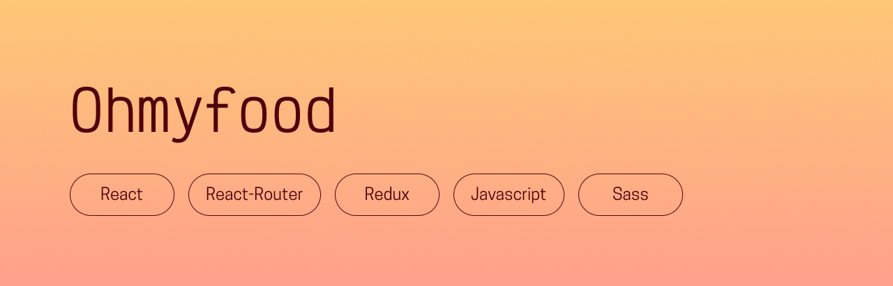

## Presentation
Ohmyfood is a fictional service that allows customers to order the dishes they want to eat at a restaurant ahead of time. This was originally project 3 of my OpenClassrooms front-end development program, made with HTML and Sass – I decided to give it a fresh coat of paint with my new skills and remake it using React and Redux ! This version has functional likes (you will see an additional section of your favorite restaurants once you start liking) and a functional cart.

## Prerequisites
- [NodeJS (version 16.17.0)](https://nodejs.org/en/)
- [NPM (version 9.4.0)](https://www.npmjs.com/)

## Getting started
- Run `$ npm install` to install all dependencies
- Run `$ npm start` to see the project!

## Thanks for reading, and happy coding!  
Chloé Adrian
